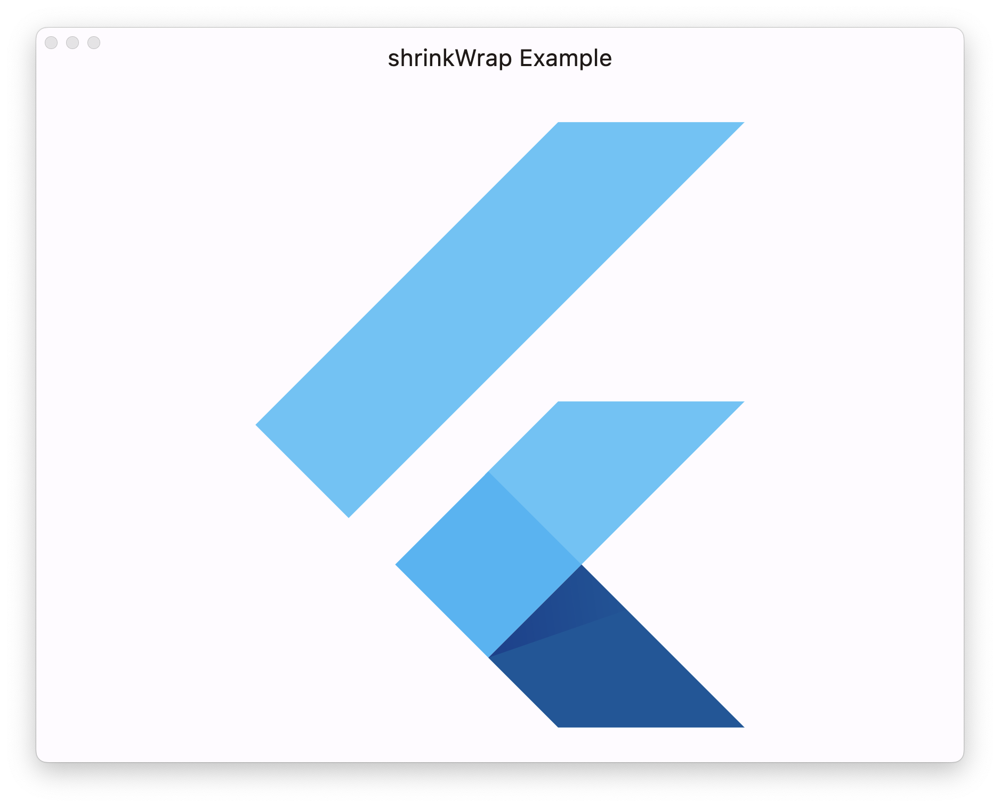
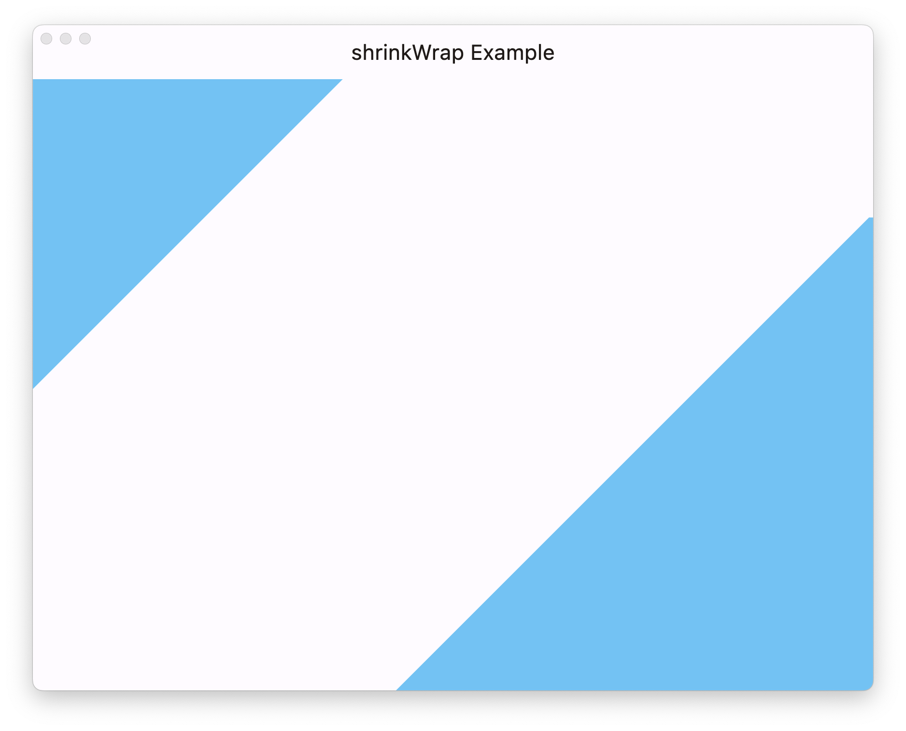
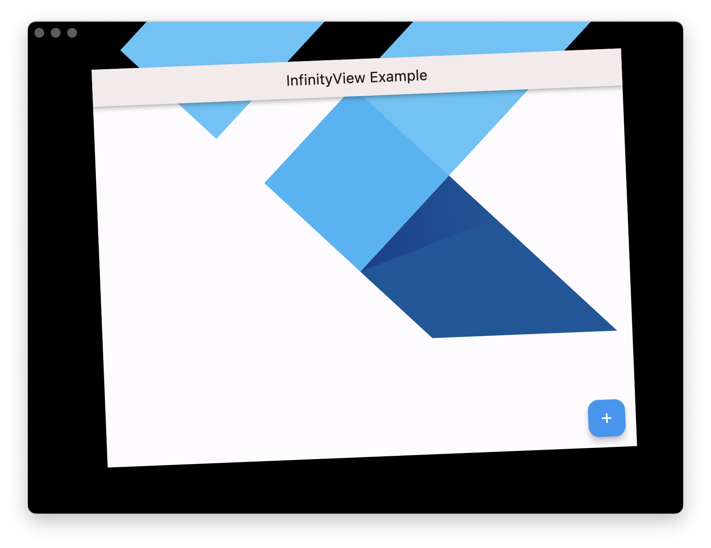

# infinity_view


  Infinity View allows you to easily create an infinite viewport for your widget. Be it an image, a canvas, or your entire app—the sky is the widget!

Unlike `InteractiveViewer`, it has no boundaries, allowing you to zoom in or out, pan through or around, and rotate as much as you’d like.

##  Features

* Works great on all platforms, supporting touch, mouse, and trackpad with device-specific control.
* Highly customizable, allowing you to only allow transformations when certain conditions are met.
* [**Unlimited power!**](https://www.youtube.com/watch?v=e_DqV1xdf-Y) You can put _anything_ within your InfinityView, you can pan as far away from your child widget, you can zoom in or out as far as you want.
  

##  Getting started

Install the package:
  `flutter pub add infinity_view`

Import the package (if you use Notepad as your IDE):
`import ‘package:infinity_view/infinity_view.dart`

And finally wrap the widget you desire in the `InfinityView`:

```dart
InfinityView(
	child: Image.network(‘https://i.imgur.com/tCoqEwy.gif’);
)
```
  

##  Usage

  

InfinityView is very simple to use, just wrap a widget in it and you’re already there. But, what makes InfinityView so great is its flexibility (up, down, left, right, in, out, and [_around town_](https://www.youtube.com/watch?v=XCXl0Y8Q3GI)—ah yeah, that’s flexible).

By default, rotation is disabled, but you can enable that with `shouldRotate`:

```dart
InfinityView(
	shouldRotate: true,
	child: ...,
)
```

What if you want to limit what events can affect the transformation?  
You can use `translationTest`, `scaleTest`, and `rotationTest`.

These parameters take a `TransformTestCallback` which provides `GenericTransformUpdateDetails` and returns a boolean. The `GenericTransformUpdateDetails` includes a bunch of information about the input for you to compare with.

If you only wanted to pan if the right mouse button is down, you could do that with a `translationTest`:

```dart
InfinityView(
	translationTest: (details) => details.buttons == kSecondaryMouseButton,
	...
)
```
  This will work! But, it also doesn’t take into consideration that not all devices use a mouse, or you can go a little more in depth:
```dart
InfinityView(
	translationTest: (details) {
		if(details.kind == PointerDeviceKind.mouse &&
		   details.buttons != kSecondaryMouseButton)
		   return false;
		return true;
	},
	...
)
```
  This will now only allow you to pan with the right mouse button on a mouse, but now it will accept any trackpad and touch pan events. We can get even more specific if we want:

```dart
InfinityView(
	translationTest: (details) {
		return details.buttons == kSecondaryMouseButton ||
			   details.pointerCount >  1  ||
			   details.kind ==  PointerDeviceKind.trackpad;
	},
	...
)
```
This will only pan if:

 1. **Mouse**: the right button is pressed.
 2. **Touch**: two fingers (or more) are being used.
 3. **Trackpad**: always.
 The reason we always use trackpad is because the only events that the trackpad will send is the PanZoomUpdate, meaning that someone is scrolling, scaling, or rotating. Click events are still perceived as mouse input.

Perhaps you want to only allow certain transformations based on external conditions. For example, you only want to scale if the control key is being pressed:

```dart
bool isControlPressed = false;

RawKeyboardEvent(
	onKey: (e) => isControlPressed = e.isControlPressed
	child: InfinityView(
		scaleTest: (details) => isControlPressed,
		child: ...
	),
)
```

Simple!

### Are you experiencing issues?
You might need to use `shrinkWrap`.

By default, `shrinkWrap` is set to true. This passes the constraints of the `InfinityView` onto the child widget. While the widget is not necessarily limited to those constraints, it will affect the layout.

If you’re using a widget with an infinite size, such as `Stack`, you must have `shrinkWrap` set to true as you cannot have an infinitely sized widget inside an infinitely sizeable widget.

By turning off `shrinkWrap` the `InfinityView` has a maximum size of infinity which means that no constraints are passed onto the child widget. This means that the child widget must have a defined size less than infinity.

To demonstrate how `shrinkWrap` works, here’s a very basic example:

```dart
InfinityView(
  shrinkWrap: true, // This is the default value.
  child: FlutterLogo(size: 5000),
)
```



If we set the `shrinkWrap` to false, it’s no longer bounded by the parent container and can take up its full size.



Both are still infinitely transformable.

Again, just because the constraints are passed onto the child container does not mean that it cannot go beyond those constraints. You can use a `Stack` with `shrinkWrap`, but you’ll get an error without it.

```dart
InfinityView(
  shrinkWrap: true, // This is the default value, specifying this is not required.
  child: const Stack(
    alignment: Alignment.center,
    clipBehavior: Clip.none,
    children: [
      Positioned(
        width: 5000,
        height: 5000,
        child: FlutterLogo()
      ),
    ]
  ),
)
```

Scaffold is a similarly infinite widget, so `shrinkWrap` must be enabled.



You’ll notice the `FlutterLogo` is also transformed. If you’re nesting InfinityViews, the parent InfinityView `shrinkWrap` must be true as the `InfinityView` takes up as much space as is possible, and in the case of an unshrinkwrapped `InfinityView`, that possible space is infinite.

##  Additional information

  

This is a living package. If you find any bugs or have a feature request, open an issue. And if you want to contribute to it, that’s great too! Pull requests will be reviewed.